## Table of contents

## The Program

In March 2026, I led the AI Literacy Training Program — Phase 1 — across 40 minority schools in Telangana. The goal was simple: give students who had never been exposed to technology a real introduction to computers and artificial intelligence.

I managed the entire program. I coordinated the trainers, designed the curriculum, and oversaw the rollout across all 40 schools. Out of those 40, I personally went to three schools to teach the sessions myself.

2,051 students. That's how many we reached in Phase 1.

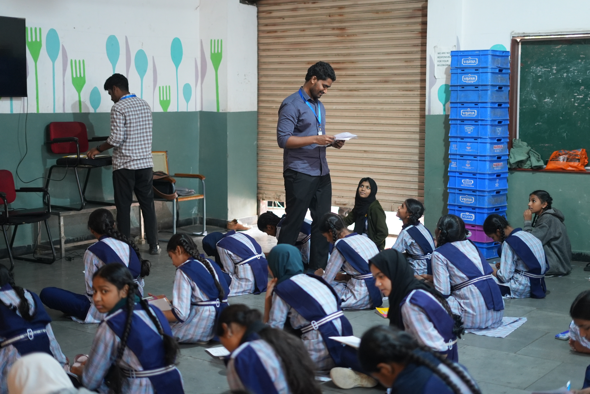

## Why These Schools

These were minority schools — schools where most students had never touched a laptop, where the computer lab (if there was one) had three working machines for 200 students.

The gap isn't just about technology. It's about exposure. When you grow up in an environment where nobody around you works in tech, you don't even know it's an option. You can't dream about something you've never seen.

That's what this program was about. Not making engineers out of every student. Showing them that this world exists, and that it's for them too.

## What We Taught

We started from the very basics and worked our way up. Most of these students had zero tech background, so we couldn't skip steps.

Here's what the curriculum covered:

- **Computer Basics** — What is hardware? What is software? What is a computer actually doing when you use it? For many students, this was the first time anyone explained these things to them.
- **What is Artificial Intelligence?** — We started with a simple definition: AI is a software that mimics human intelligence. Then we broke it down with examples they could relate to — voice assistants, YouTube recommendations, photo filters.
- **Prompting** — This is where it got exciting. We taught students how to write prompts to generate images, videos, and songs using AI tools. The concept that you could type a sentence and get an image back — that blew their minds.
- **Hands-on with AI Tools** — Students didn't just watch. They used AI tools themselves to create real things.

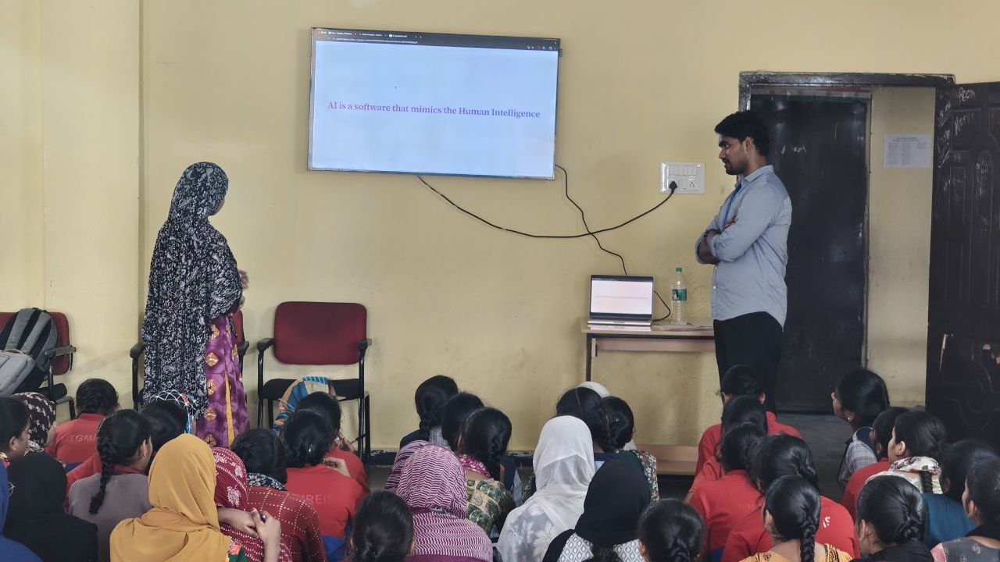

## What the Students Built

This was the best part of the entire program. The students didn't just learn — they created.

Using different AI tools, students built:

- **Websites** — actual websites, designed and generated with AI assistance
- **Songs** — AI-generated music based on their prompts
- **Videos** — short videos created using AI video generation tools

These are students who had never used a laptop before the program. And by the end of the session, they were generating websites and music. That's the power of the right exposure at the right time.

## Teaching at the Schools

Out of the 40 schools, I personally taught at three. The photos here are from those sessions.

The best part was sitting down with the students after the presentation. Not standing at the front — actually sitting on the floor with them, going through things one-on-one.

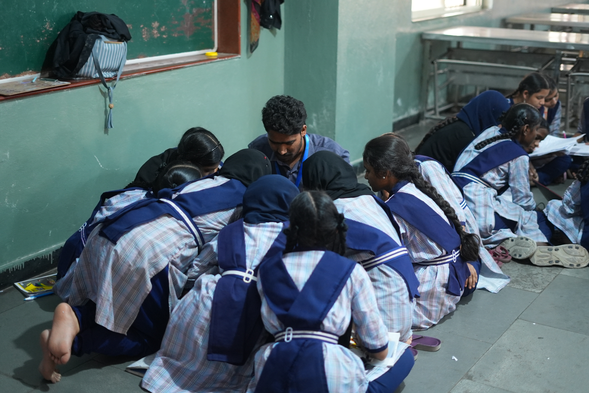

That's where the real teaching happened. Not from the slides. From the floor. When a student can point at the screen and ask "but how does it know?" — that's when you know they're actually learning.

At the end of some sessions, we gave out chocolates. Small thing. But the way those kids reacted — you'd think we gave them the world.

## The Yakatpura Session

One of the most memorable sessions was at Yakatpura. The classroom was packed. The energy was different — these students were loud, curious, and completely unafraid to ask questions.

After the session, they all wanted a selfie. Every single one of them crowded in. That photo is one of my favorites from the entire program.

## 2,051 Students Later

2,051 students across 40 schools in one phase. Every sign-up sheet, every attendance register — we counted every single one.

These aren't just numbers for a report. Each one is a student who now knows what a computer does, what AI is, and that they can use it to create things. Some of them built their first website that day. Some of them heard the word "artificial intelligence" for the first time.

The program isn't done. This was Phase 1. But what we saw in these 40 schools — the curiosity, the excitement, the things these students created — that's enough to know this is worth continuing.

## Photo Gallery

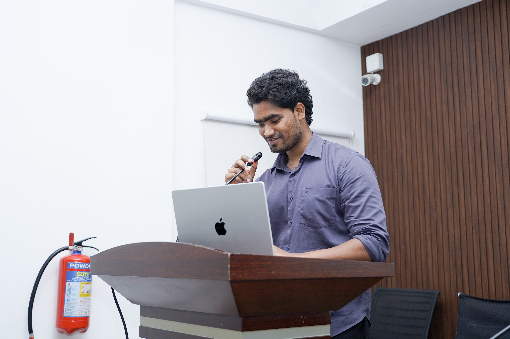

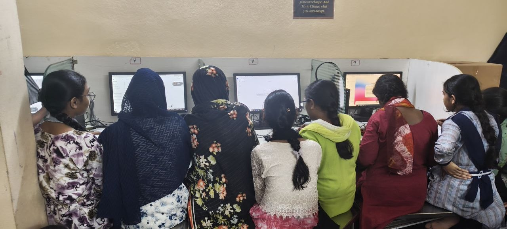

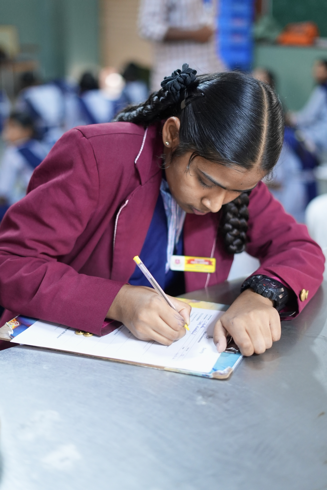

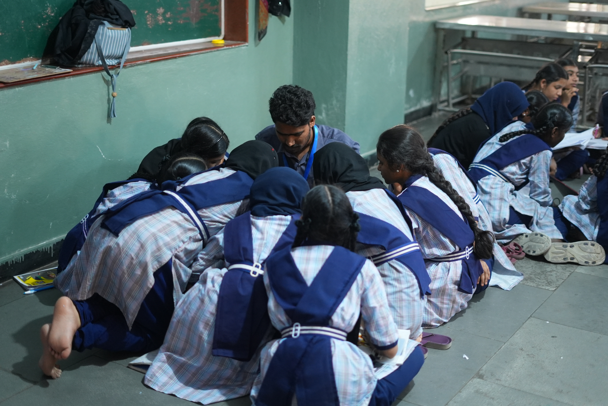

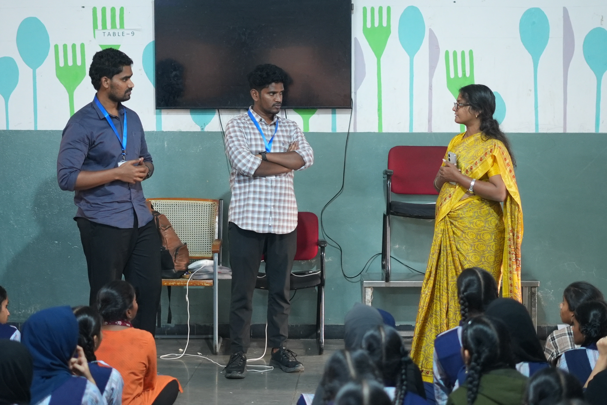

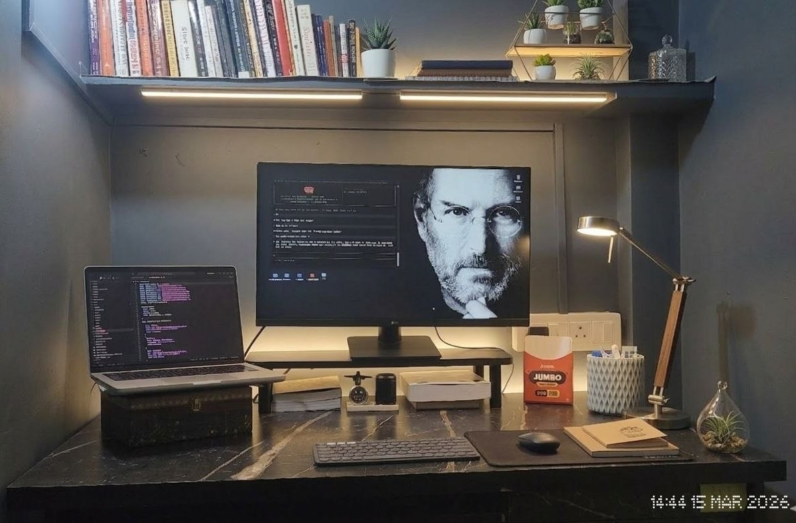

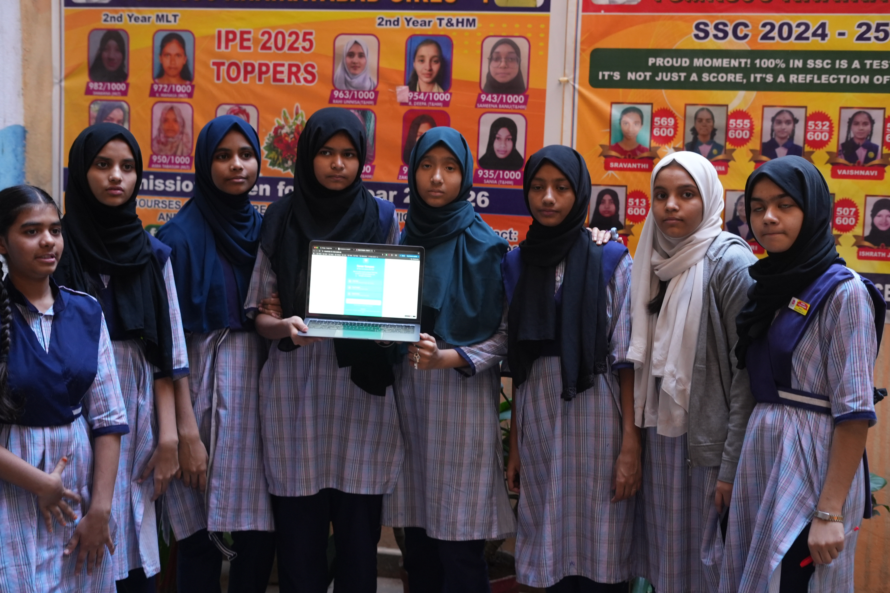

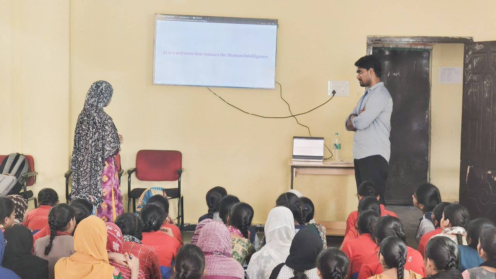

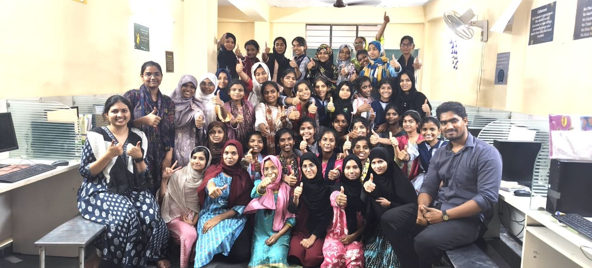

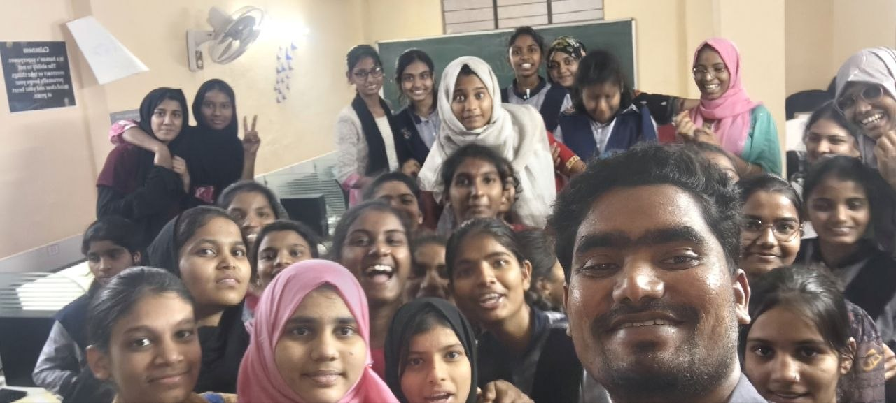

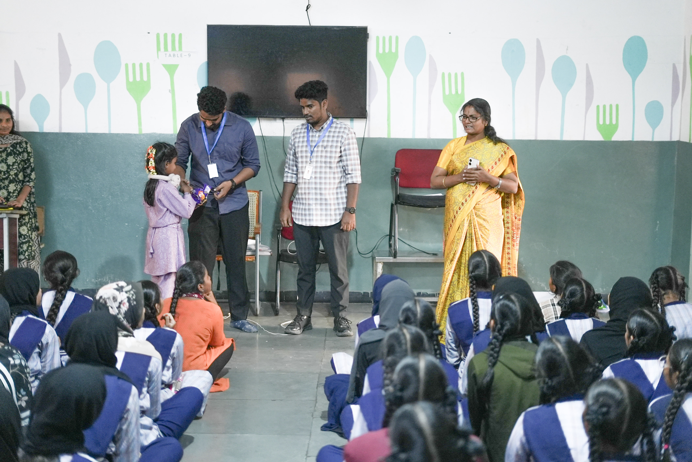

## What This Taught Me

I went into this program thinking I was going to teach students about AI. I came out realizing they taught me more than I expected.

They taught me that curiosity doesn't need a laptop. That the best questions come from people who have real problems, not theoretical ones. That exposure is the most underrated thing in education.

If you're a developer reading this and you've been thinking about giving back — start with exposure. You don't need a fancy curriculum. You don't need expensive equipment. You just need to show up and show them what's possible.
