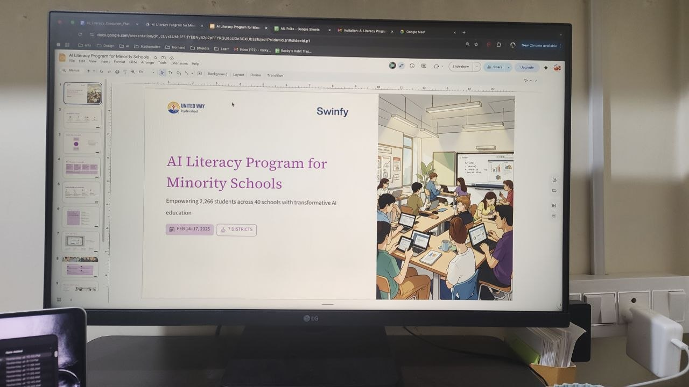
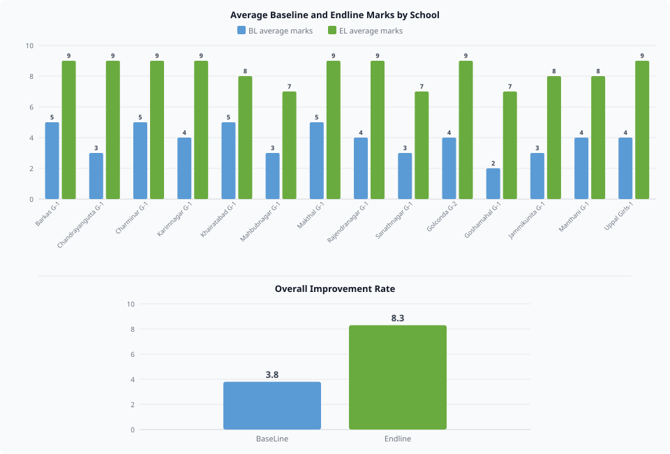
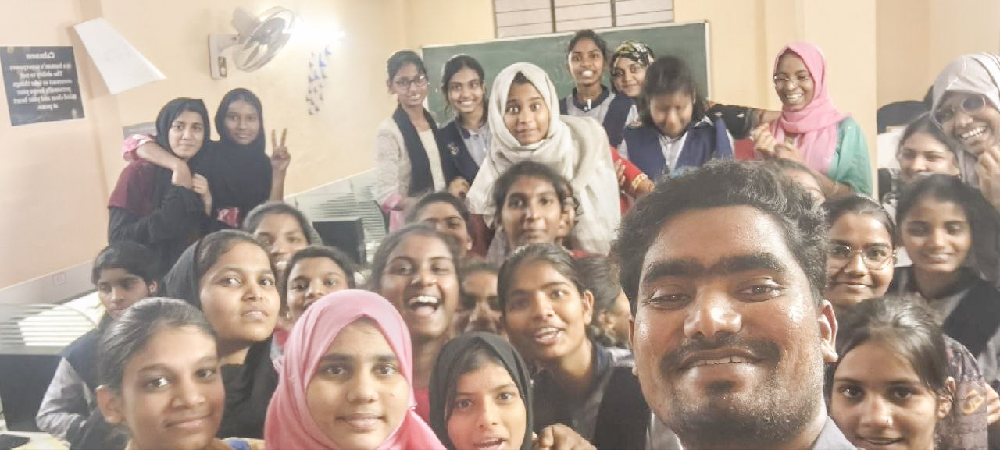

## The Question That Stopped Me

Her name was Ameena.

It was day two. We had just finished the prompting session and the girls were gathered around laptops in groups, typing their own questions into ChatGPT. Biology questions. Maths problems. History. The answers kept coming, clear and instant. You could feel the energy in the room shifting into something I did not expect from a first session.

I was moving between groups, helping each one, typing questions with them, watching their faces as the answers appeared on screen.

Then Ameena raised her hand and stopped me.

She said, sir, it is answering biology, maths, history, everything we need. Then what do we have to study? What will we become in the future?

I stood there for a moment.

She was in 9th standard. She had never used AI before that week. And she had just asked the question that most adults in technology are still afraid to ask out loud.

I felt something I did not expect. Not concern. Not worry. Pure happiness. Because that question does not come from fear. It comes from curiosity. From a mind that is already thinking beyond the classroom, beyond the textbook, into the future.

That is when I knew this program was working.

## How the Program Started

This started with a phone call from Sathish sir, my mentor. He has trained thousands of IT professionals and watched technology access change lives.

His belief was simple: AI is not the future. It is already here. If we wait until college to teach it, we lose a generation.

So we chose TMREIS, 40 government residential schools for minority communities in Telangana. 9th class girls who had never touched a laptop. We built a 4-day curriculum, tested it until anyone could follow it, trained a team of IT professionals to deliver it, and launched.

## The Curriculum

Four days. Twelve hours.

- **Day 1:** The foundation. Computer basics, the internet, and what AI actually is.
- **Day 2:** Prompting across text, images, audio, and video.
- **Day 3:** Creation. Students built websites, apps, and games using tools like Lovable and Canva.
- **Day 4:** AI ethics and a final student project.

Simple, practical, and built for students meeting AI for the first time.

## The Classrooms

I personally taught at two schools: Khairatabad G1 and Yakhuthpura G1. And I visited Asifnagar as Head of the program to check on my trainers.

Every school had the same thing nobody expected. Pure energy.

At Khairatabad from day one the classroom felt alive. We started with a drama skit, students acting out the parts of a computer, playing hardware and software, becoming the machine itself just to understand what it means. They laughed. They argued about who gets to be the processor. They remembered every part because they had lived it for ten minutes. We told them real stories of the people who built this technology. Not textbook names. Real humans with real struggles who changed the world from scratch.

At Yakhuthpura the energy was just as high but something felt different in the room. These girls were quieter at first but their thinking went deeper. When they started building their ideas on day three you could see they had been processing everything since day one. Their projects told you that.

Day two at both schools was the same story. Prompting. We divided them into groups, handed out laptops and watched what happened.

They asked ChatGPT about their textbooks. About space. About how the universe was made. One group typed, what will Hyderabad look like in 2040? They were not doing homework. They were thinking about their future out loud.

In the middle of that session questions started flying at me from every direction.

Does AI know what will happen tomorrow? Can it solve my maths problems? Does it understand Telugu? Can it write a story about my village? Does it get tired like humans do?

I answered every single one. And every answer led to three more questions. That is when you know a classroom is alive.

Day three was building. We constructed prompts together, what do you want in a game, what should your website do, what problem do you want to solve. Then we polished those prompts with ChatGPT and pasted them into Lovable, Canva, Bolt.new. Applications appeared on screen in minutes. Games. Websites. Things they described, now real in front of them.

Day four we asked one question to the class, is AI beautiful or not? That opened everything. Where should we use it. How should we use it. Where should we not. These girls who had never touched AI five days ago were now debating its place in the world. Then they went and built their own projects.

At Asifnagar I went as Head of the program to check on my trainers. I spent thirty minutes with the students, asked them questions on what had been covered. They were sharp. On point. They told me everything they had learned and showed me what they had built so far.

I left that school quietly proud of every trainer on my team.

## The Impact

On day four they ran towards me.

Not walked. Ran. Every group wanted to show their idea first, explain the problem they had chosen to solve, tell me what they had built.

I was not ready for what I heard.

From Khairatabad, one group built [Career Compass](https://streamfinder-for-india.lovable.app), a platform to guide students after 10th on which stream to choose based on their interests. They built it because nobody had guided them. They did not want the next student to feel the same confusion.

Another group built [FarmingEasy](https://earth-whisper-plan.lovable.app/), a sustainable farming advisor to help farmers improve crops while protecting the soil. Girls from poor families thinking about the farmers in their villages.

One group built [NoorSeva](https://meal-connect-app.lovable.app), No Food Waste, No Hunger. A platform to connect surplus food with people who need it. They named it NoorSeva. Think about that for a moment.

One group built [Taleem Se Taraqqi](https://taleem-se-taraqqi-hub.lovable.app), a website for their own school. Because they wanted their school to have a presence online.

Two more groups built [Nature Knows](https://nature-knows-app.lovable.app) and [Ready Home Haven](https://ready-home-haven.lovable.app/).

From Yakhuthpura, one group built [StudyBuddy](https://study-buddy-quest-77.lovable.app/), notes and previous year papers with AI summaries for classes 6 to 12. Built for every student like themselves who had no resources.

Another group built [CometoSaveLife](https://vital-peek-demo.lovable.app/), upload your health report and AI explains your deficiencies in plain language. Girls from families where nobody can afford a doctor to explain a blood test. They thought about that problem and built something.

The other groups built [Path Forward](https://path-forward-org.lovable.app), [Green Earth Haven](https://green-earth-haven.lovable.app/), [Safe Haven Guide](https://safe-haven-guide-45.lovable.app/), and a [Canva portfolio](https://mynameraghu.my.canva.site/untitled-app).

The apps were not fully functional. The code was not perfect. But every single idea was real. Every single problem was something they had seen with their own eyes in their own communities.

Farmers. Hunger. Health. Education. Career guidance. Their school.

They did not build games. They did not build entertainment. Their first instinct with technology was to help someone more vulnerable than themselves.

I stood there and could not speak for a moment.

These girls had never touched AI twelve days before this. And in twelve hours of instruction they had identified real problems and built something, however small, to address them.

---

Before the program started we gave every student a baseline test. At the end of day four we gave the same test again.

Average score before: 3.8 out of 10. Average score after: 8.3.

Twelve hours. That is what access does.

## Gallery

## What This Taught Me

Walking into those classrooms took me back to where I started.

I sat on the floor in a government school until 10th class. No computers. No internet. No access to any of it. I know exactly what it means to have talent and no tools.

These girls are me. Ten years earlier.

What I did not expect was how much they would inspire me. Their energy, their ideas, their instinct to build something for others despite having so little themselves. I left those classrooms wanting to work harder, not the other way around.

This year our goal is to expand this program to every school in Telangana. And we will not stop there.

Because here is what I believe.

When the internet arrived, the people who understood its trajectory early went and built Google, Facebook, Amazon. They saw what was coming before everyone else and they moved.

We are in that same moment right now. With AI.

The students who get access to it today, who learn to think with it, build with it, use it responsibly. They are the ones who will become the next founders and leaders of this country.

I want to be part of making that happen.

Talent was never India's problem. It never was.

We just have to get out of the way and give it access.
